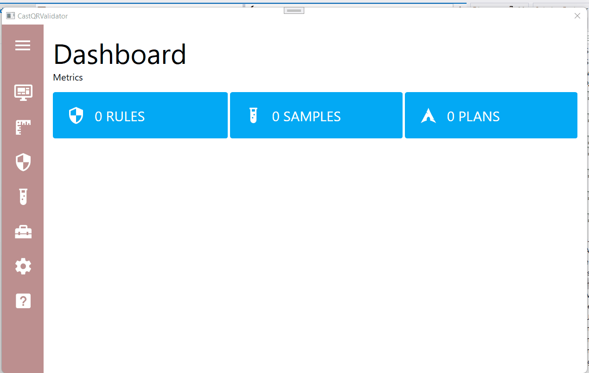

# CastQRValidator

Tools used to validate plugin's integration made with CAST Exension SDK.

https://github.com/CAST-projects/Extension-SDK

## Specs

### Screen sizes and breakpoints

[Large](https://learn.microsoft.com/en-us/windows/apps/design/layout/screen-sizes-and-breakpoints-for-responsive-design#breakpoints) :
- 1024x640 (Minimum Size)
